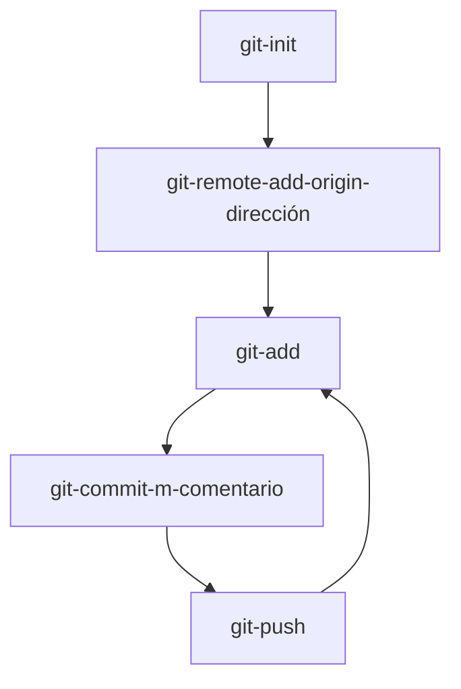

# Guía básica del uso de Git
   
**¿Qué es Git?**
  - Git es un software de control de versiones diseñado por Linus Torvalds (código abierto), pensando en la eficiencia, la confiabilidad y compatibilidad del mantenimiento de versiones de aplicaciones cuando estas tienen un gran número de archivos de código fuente.
  - Su propósito es llevar registro de los cambios en archivos de computadora incluyendo coordinar el trabajo que varias personas realizan sobre archivos compartidos en un repositorio de código.
    <br><br>

      
**¿Qué es GitHub?**
-  GitHub es una plataforma basada en la nube donde puedes almacenar, compartir y trabajar junto con otros usuarios para escribir código.
-  Almacenar tu código en un "repositorio" en GitHub te permite lo siguiente:
    - Presentar o compartir el trabajo.
    - Seguir y administrar los cambios en el código a lo largo del tiempo.
    - Dejar que otros usuarios revisen el código y realicen sugerencias para mejorarlo.
    - Colaborar en un proyecto compartido, sin preocuparse de que los cambios afectarán al trabajo de los colaboradores antes de que esté listo para integrarlos.
    - El trabajo colaborativo, una de las características fundamentales de GitHub, es posible gracias al software de código abierto Git, en el que se basa GitHub.
<br><br>

**¿Qué necesitamos para usar Github en nuestos proyectos?**  
  1. Darnos de Alta Github:
     - Lo primero es registrarnos en la página de GitHub.
     - Pinchamos en el enlace para ir a dicha página [Página Gitub](https://github.com/).
     - Una vez adentro le damos al botón ***Sign up***.
     - Rellenamos el cuestionario, se sigue lo que va mostrando y ya último ya se ha creadola cuenta.
  2. Descargarnos e instalar Git:
     -  Para poder descargarlo hay que ir a la página oficial de Git.
     -  Pinchamos en el enlace para ir a dicha página [Página Git](https://git-scm.com/downloads/win).
     -  Una vez adentro se le pincha donde pone ***Click here to download*** y se descargará la última versión.
     -  Ya descargado, se ejecuta el .exe y se sigue las instrucciones hasta acabar la instalación.
  3. Crear carpeta en disco local:
     -  Para subir nuestros proyectos, se necesita crear carpetas para estar organizados y saber que se va a subir.
     -  Para crear una carperta, ay que ir al sitio donde se va crear.
     -  Pinchando con el botón derecho del ratón o clicando en la barra de arriba del explorador de archivos del windows donde pone ***Nueva Carperta***.
     -  Se le da el nombre que se quierá dar al proyecto a subir y ya se tendría la carperta deseada.
     <br><br>
     
## Comandos habituales para trabajar con repositorios remotos:  
  -  Los comandos mas habituales son:
```
1 - git init = sirve para iniciar la subida de nuestro proyecto.
2 - git remote add origin (la dirección del repositorio) = sirve para enlazar la carperta de nuestro proyecto con la dirección del Github.
3 - git add = sirve para agregar un archivo solamente escribiendo su nombre o si se quiere subir todo lo que tenemos es escribir espacio + .
4 - git commit -m "(comentario)" = sirve para añadir un comentario a lo que se va a subir.
5 - git status = sirve para saber si el estado de lo que vamos a subir esta listo o se necesita preparlo.
6 - git push = sirve para subir nuestro proyecto a la nube.
```
  -  La primera vez que se le da a push salta un ⚠️, solo tendríamos que agregar lo que nos pone en pantalla.
  -  Las proximas subidas ya no dará el ⚠️.
  -  Secuencia de comandos para subir nuestros repertorios:


<br><br>
# Clonar un Repositorio
Para clonar un repertorio, lo primero hay que buscar el repertorio que vamos a clonar a nuestro ordenador.
Una vez que ya hemos seleccionado lo que vamos a clonar, hay que ir al **Explorador de archivos** de nuestro ordenador.
Ir a donde vamos a guardar el repertorio y crear una carperta.
Abrir el terminal Git y escribir códigos:
1. git init
2. git clone
Esperamos y ya se descarga lo que hemos querido clonar.

<br><br>
# Hacer Fork de un repositorio
Una vez buscado, se le pincha en el botón ***FORK*** y luego a ***Create a new fork***.
